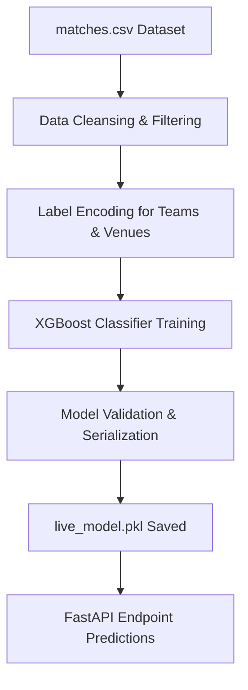

# 🏏 IPL Predictor: AI-Powered Live Match Analysis Platform

[](https://fastapi.tiangolo.com/)
[](https://react.dev/)
[](https://xgboost.readthedocs.io/)
[](https://supabase.com/)

A premium, glassmorphism-inspired **IPL Predictor Platform** that forecasts match outcomes in real-time. Combining historical data modeling, live cricket API streams, and interactive charts, it delivers live win-probability updates, ball-by-ball commentary, team statistics, and scorecard visualization.

---

## 🌟 Key Features

*   🤖 **AI Win Probability Forecasts**: Real-time predictions powered by an **XGBoost Classifier** model trained on historical IPL match trends.
*   📡 **Live Match Stream & Scoring**: Seamless integration with **CricAPI** to stream live team scores, overs, run-rates, wickets, and play status.
*   📈 **Win Probability Trend Chart**: A dynamic line chart using **Recharts** displaying probability fluctuations ball-by-ball.
*   🏆 **Official Team Branding**: Sleek custom colors, SVG icons, and official high-resolution team logos for all 10 IPL franchises.
*   📊 **Interactive Match Stats**: Dedicated tabs for live scorecards, granular team stats (dot ball %, boundary %, boundaries hit), and ball-by-ball commentary.
*   🎮 **Interactive Demo Mode**: Simulate match fluctuations in a interactive environment when no live matches are active.
*   ☁️ **Supabase Logs**: Stores historical prediction logs for model retraining and performance tracking.

---

## 📂 Datasets Used

The machine learning model leverages granular historical IPL matches data. Due to file size limitations (>100MB), the primary source dataset is kept locally and excluded from version control, while processed configurations are tracked.

### 1. `matches.csv` (~102.5 MB)
*   **Source**: Extensive historical IPL match records.
*   **Dimensions**: Full record of match parameters since the inception of the tournament.
*   **Selected Features**:
    *   `batting_team` / `team1`: The team currently batting or set as Team 1.
    *   `bowling_team` / `team2`: The defending team.
    *   `toss_winner`: Franchise winning the coin toss.
    *   `toss_decision`: Choice elected (batting/fielding).
    *   `city`: Venue location, capturing pitch/climate conditions.
*   **Target Label**: `winner` / `match_won_by`.

### 2. `deliveries.csv` (~18.2 MB)
*   **Source**: Granular ball-by-ball delivery metadata.
*   **Details**: Used to compute team-specific boundary averages, run velocities, and wicket distributions to assist feature engineering.

---

## 🧠 Machine Learning Pipeline



*   **Model**: `XGBoostClassifier`
*   **Preprocessing**: `LabelEncoder` tracks mappings for all categorical values (teams, toss outcomes, cities).
*   **Output**: Live class probabilities (`predict_proba`) representing the percentage chance of winning for both teams.

---

## 🏗️ Project Architecture

```
IPL-Predictor/
├── ipl-ai-platform/
│   ├── backend/                 # FastAPI Application
│   │   ├── app/
│   │   │   ├── cache.py         # Caching system
│   │   │   ├── db.py            # Supabase logging client
│   │   │   ├── live_fetch.py    # Live API stream processing
│   │   │   ├── main.py          # REST endpoints
│   │   │   ├── model.py         # Inference handler
│   │   │   └── scorecard.py     # Live scorecard scraper
│   │   ├── data/
│   │   │   ├── cricket_data_2026.csv
│   │   │   └── deliveries.csv
│   │   ├── model/
│   │   │   └── live_model.pkl   # Serialized model binary
│   │   ├── requirements.txt
│   │   └── train.py             # XGBoost model training script
│   └── frontend/                # React.js SPA Web App
│       ├── public/              # Static assets & logos
│       ├── src/
│       │   ├── App.js           # Core view & tab layout
│       │   ├── App.css          # Premium glassmorphism styles
│       │   ├── LiveGraph.jsx    # Win probability trend line
│       │   ├── Matches.jsx      # Match selection slider
│       │   └── Scorecard.jsx    # Live scorecard table
│       └── package.json
└── README.md
```

---

## 🚀 Getting Started

### 📋 Prerequisites
*   **Python 3.10+**
*   **Node.js v16+** & **npm**

### 🔧 Backend Installation

1. Navigate to the backend directory:
   ```bash
   cd ipl-ai-platform/backend
   ```
2. Install Python requirements:
   ```bash
   pip install -r requirements.txt
   ```
3. Set up your environment variables:
   Create a `.env` file in `ipl-ai-platform/backend/` and supply:
   ```env
   CRIC_API_KEY=your_cric_api_key_here
   SUPABASE_URL=your_supabase_url_here
   SUPABASE_KEY=your_supabase_anon_key_here
   ```
4. Train the ML model:
   ```bash
   python train.py
   ```
5. Start the FastAPI development server:
   ```bash
   uvicorn app.main:app --reload
   ```
   The backend API will run on `http://127.0.0.1:8000`.

---

### 💻 Frontend Installation

1. Navigate to the frontend directory:
   ```bash
   cd ipl-ai-platform/frontend
   ```
2. Install Node dependencies:
   ```bash
   npm install
   ```
3. Run the application locally:
   ```bash
   npm start
   ```
   The application will launch on `http://localhost:3000`.

---

## 🎨 Premium UI Aesthetics
*   **Glassmorphism Effects**: Translucent cards with subtle white borders, drop shadows, and high backdrop-blurs.
*   **Dynamic Theme Colors**: UI details automatically adjust to matching franchise theme colors (e.g., Yellow for CSK, Blue for MI).
*   **Micro-Animations**: Animated score counters, pulse lights for live match indicator badges, and smooth slide transitions.

---

## ⚠️ Important Notes
❌ Large dataset files are excluded from GitHub  
🔐 Never upload .env file.  
📡 Requires valid API keys for live data  


---

## 🧑‍💻 Author

Ankit Singh Yadav

---

## 🔒 License
This project is licensed under the MIT License - see the [LICENSE](LICENSE) file for details.
